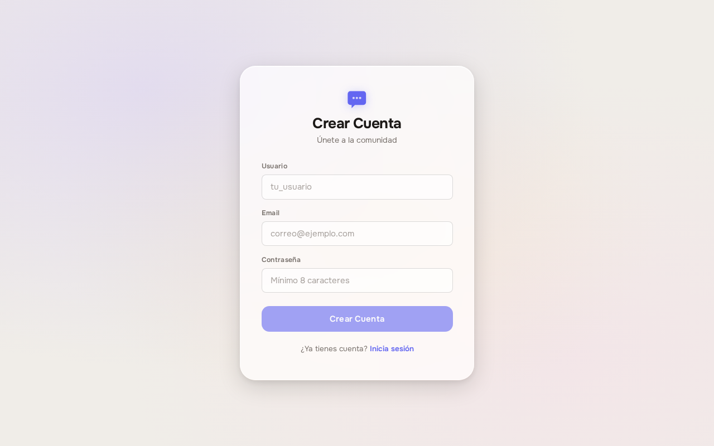
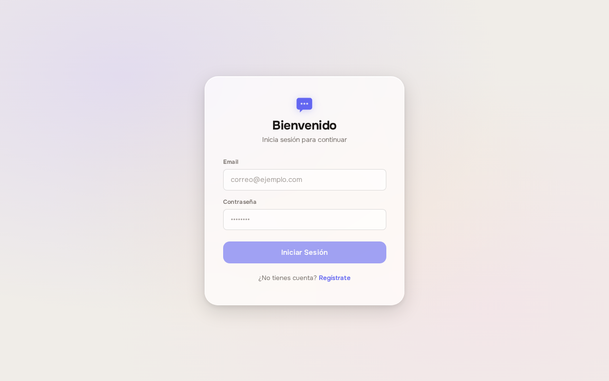
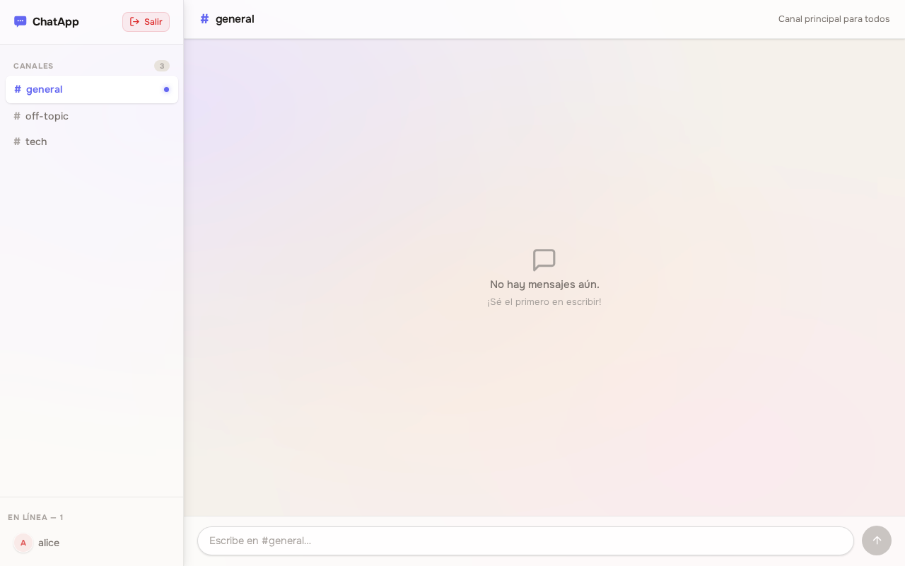
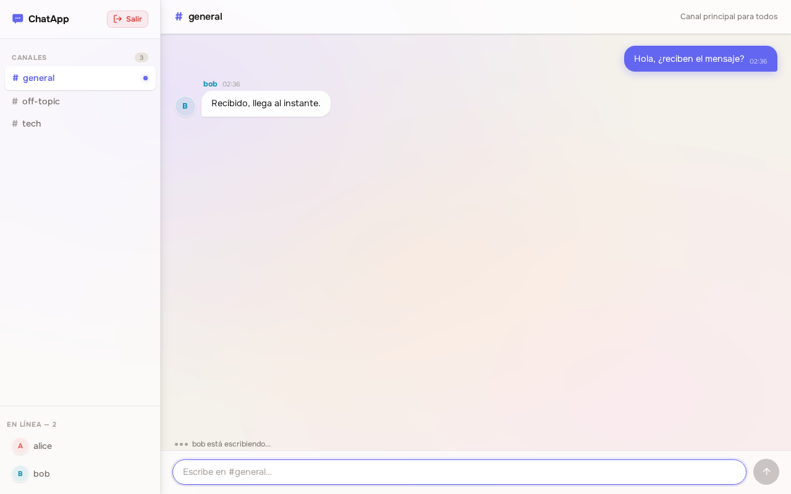
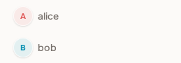
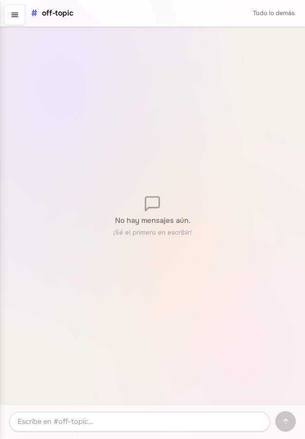
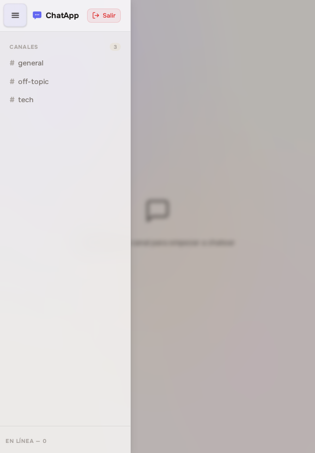

# Manual de usuario

ChatApp es una aplicación de mensajería en tiempo real organizada en canales temáticos. Este documento explica cómo acceder, crear una cuenta, conversar y ver quién está conectado.

## 1. Acceso al sistema

La aplicación se abre desde cualquier navegador moderno, sin instalar nada:

**https://ug-disc-chat.vercel.app**

Funciona en computadora, tableta y teléfono. Se necesita conexión permanente a internet: los mensajes llegan en el momento en que se envían.

> El servidor se suspende tras un periodo de inactividad. Si es el primer acceso del día, la pantalla de inicio de sesión puede tardar cerca de un minuto en responder. Es normal; basta esperar.

## 2. Crear una cuenta

En la pantalla de inicio de sesión, seleccione **¿No tienes cuenta? Regístrate**.

Complete los tres campos:

| Campo | Requisito |
|---|---|
| Usuario | Al menos 3 caracteres. Es el nombre que verán los demás participantes |
| Email | Un correo con formato válido. Se usa para iniciar sesión |
| Contraseña | Al menos 8 caracteres |

Pulse **Crear Cuenta**. Si algún dato no cumple el requisito, el mensaje aparece bajo el campo correspondiente y el botón permanece inactivo. Si el correo ya pertenece a otra cuenta, se muestra el aviso **El email ya está registrado**. Si el nombre de usuario está en uso, aparece **El nombre de usuario ya esta registrado**.

Al completarse el registro, la sesión se inicia automáticamente y se entra al chat.

## 3. Iniciar sesión

El acceso se realiza con **correo electrónico y contraseña**, no con el nombre de usuario.

Si los datos no coinciden, aparece el mensaje **Credenciales incorrectas**. El aviso genérico evita revelar de forma explícita si una cuenta existe o no.

La sesión permanece abierta durante 24 horas, incluso si cierra el navegador. Transcurrido ese plazo debe volver a identificarse.

## 4. Conectarse a un canal

Tras iniciar sesión aparece la pantalla principal. A la izquierda está la lista de **canales** disponibles:

| Canal | Contenido |
|---|---|
| `general` | Canal principal para todos |
| `tech` | Conversaciones sobre tecnología |
| `off-topic` | Todo lo demás |

Seleccione un canal para entrar. Hasta entonces, la zona de conversación muestra el aviso *Selecciona un canal para empezar a chatear*.

Al entrar se cargan los **últimos 20 mensajes** del canal, de modo que se recupera el hilo de la conversación aunque no se estuviera presente. Un canal sin mensajes muestra *No hay mensajes aún. ¡Sé el primero en escribir!*.

Solo se participa en un canal a la vez. Al cambiar de canal, la conexión anterior se cierra y se abre la del canal elegido.

## 5. Enviar y recibir mensajes

Escriba en el cuadro inferior y pulse **Enter**, o el botón de envío situado a su derecha.

- Los mensajes propios aparecen a la derecha; los de los demás, a la izquierda, con el nombre y la inicial de quien escribe.
- Los mensajes llegan al instante a todos los conectados al canal, sin recargar la página.
- Mientras otra persona escribe, se muestra un aviso bajo la conversación: *bob está escribiendo...*. Si escriben dos, se nombran ambas; si son tres o más, aparece *Varios usuarios están escribiendo...*.
- El límite es de 2000 caracteres por mensaje. No se pueden enviar mensajes vacíos.
- Cada mensaje muestra la hora de envío.

Los mensajes quedan guardados: al volver al canal más tarde seguirán ahí.

Si el cuadro de texto aparece deshabilitado, la conexión con el servidor se ha perdido. Seleccione de nuevo el canal para restablecerla.

## 6. Ver los usuarios conectados

Bajo la lista de canales, la sección **En línea** muestra en tiempo real quiénes están conectados al canal actual, junto al número total.

La lista se actualiza sola: cuando alguien entra al canal aparece de inmediato, y cuando lo abandona desaparece, sin necesidad de recargar.

Dos aclaraciones sobre su comportamiento:

- La lista corresponde **al canal en el que se encuentra**, no a la aplicación completa. Quien esté en `tech` no aparece en la lista de `general`.
- Si abre la aplicación en varias pestañas, su nombre figura **una sola vez**. Solo se le considera desconectado cuando cierra la última.

## 7. Uso en teléfono

En pantallas estrechas la lista de canales y de usuarios se oculta para dar espacio a la conversación. Se abre con el botón de menú de la esquina superior izquierda.

| Menú cerrado | Menú abierto |
|---|---|
| {width=7cm} | {width=7cm} |

El menú se cierra al elegir un canal, al pulsar fuera de él o con la tecla `Escape`.

## 8. Cerrar sesión

El botón **Salir**, en la parte superior de la lista de canales, cierra la sesión, desconecta el chat y regresa a la pantalla de inicio de sesión. Los demás participantes dejarán de verlo en la lista de conectados.

Conviene cerrar sesión al usar un equipo compartido: mientras la sesión siga abierta, cualquiera con acceso al navegador entra directamente al chat.

## 9. Problemas frecuentes

| Situación | Causa y solución |
|---|---|
| La página tarda mucho en cargar la primera vez | El servidor estaba suspendido por inactividad. Espere hasta un minuto |
| El cuadro de texto está deshabilitado | Se perdió la conexión. Seleccione de nuevo el canal |
| No aparecen los usuarios conectados | Verifique que ha entrado a un canal: la lista es por canal |
| No se recibe ningún mensaje nuevo | La conexión se cortó. Recargue la página y vuelva a entrar al canal |
| Al volver tras un día, la aplicación pide identificarse | La sesión dura 24 horas. Es el comportamiento esperado |
| El registro indica que el email ya está registrado | Ya existe una cuenta con ese correo. Inicie sesión con ella |
